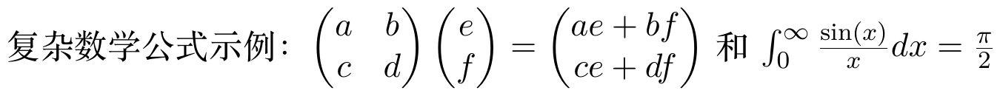

# LaTeX 文本转图片工具 (LaTeX Text to Image Converter)

将 LaTeX 格式文本渲染成高质量图片的工具，支持中文、数学公式和各种特效。适用于生成教育教学内容、题目、笔记等场景。

## 主要特性

- **LaTeX 渲染**：支持数学公式、表格、图表等各种 LaTeX 结构
- **中文支持**：完美支持中文字体渲染，多种字体可选
- **多种特效**：
  - **手写体效果**：模拟手写笔迹
  - **纸张纹理**：添加真实纸张质感
  - **随机旋转**：文本轻微旋转，增加自然感
  - **噪点和模糊**：添加适量噪点和模糊，仿真效果
  - **行宽限制**：控制每行最大字符数，自动换行
- **自定义选项**：可调节图片分辨率、背景颜色、字体等
- **批量处理**：支持批量转换多个文本
- **Web 界面**：提供友好的浏览器操作界面

## 示例展示

以下是使用本工具生成的各种效果示例：

### 行宽限制示例

设置每行最大字符数，自动换行，同时保持数学公式的完整性：

```bash
python latex_to_image.py -i "这是一个设置了行宽的示例，展示文本如何自动换行。这是一段很长的文本，我们希望它能够按照指定的字符数自动换行，同时保持数学公式 $E = mc^2$ 的完整性。" -o example_images/line_width.png --font "Songti SC" --max-chars-per-line 20
```


### 手写体效果示例

模拟手写笔迹，使文本看起来像手写的：

```bash
python latex_to_image.py -i "这是模拟手写效果的示例，可以看到文字有微妙的变化。数学公式 $f(x) = \int_{-\infty}^{\infty} e^{-x^2} dx = \sqrt{\pi}$ 也保持清晰。" -o example_images/handwriting.png --font "Songti SC" --handwriting
```


### 纸张纹理效果示例

添加纸张纹理，使文本看起来像写在真实的纸上：

```bash
python latex_to_image.py -i "这是带有纸张纹理的示例，使文本看起来像写在真实的纸上。公式 $\sum_{i=1}^{n} i = \frac{n(n+1)}{2}$ 显示在纹理背景上。" -o example_images/paper_texture.png --font "Songti SC" --add-texture
```


### 复杂数学公式示例

渲染复杂的数学表达式和公式：

```bash
python latex_to_image.py -i "复杂数学公式示例：$\begin{pmatrix} a & b \\ c & d \end{pmatrix} \begin{pmatrix} e \\ f \end{pmatrix} = \begin{pmatrix} ae + bf \\ ce + df \end{pmatrix}$ 和 $\int_0^{\infty} \frac{\sin(x)}{x} dx = \frac{\pi}{2}$" -o example_images/complex_math.png --font "Songti SC"
```



### 组合效果示例

同时应用多种效果（手写风格和纸张纹理）：

```bash
python latex_to_image.py -i "这是综合效果示例，同时应用手写风格和纸张纹理，使文本看起来像在真实纸上手写的。数学公式：$\lim_{n \to \infty} \left(1 + \frac{1}{n}\right)^n = e$" -o example_images/combined_effects.png --font "Songti SC" --handwriting --add-texture
```


## 安装说明

### 系统要求

- Python 3.7 或更高版本
- LaTeX 发行版（TeX Live、MiKTeX 等）
- Poppler（用于 PDF 转图片）

### 安装步骤

1. 克隆此仓库：

```bash
git clone https://github.com/yourusername/latex-text-to-image.git
cd latex-text-to-image
```

2. 安装 Python 依赖：

```bash
pip install -r requirements.txt
```

3. 安装 Poppler（pdf2image 依赖）：

   - **macOS**：
     ```bash
     brew install poppler
     ```

   - **Ubuntu/Debian**：
     ```bash
     apt-get install poppler-utils
     ```

   - **Windows**：
     下载 [poppler for Windows](https://github.com/oschwartz10612/poppler-windows/releases/)，
     并将 bin 目录添加到系统 PATH 中

4. 确保系统已安装 LaTeX 发行版：
   - [TeX Live](https://www.tug.org/texlive/)
   - [MiKTeX](https://miktex.org/)

## 使用方法

### 命令行使用

#### 基本用法

```bash
python latex_to_image.py -i "E = mc^2" -o formula.png
```

#### 高级特性

```bash
# 使用手写体效果
python latex_to_image.py -i "这是手写的公式 $E = mc^2$" -o handwriting.png --handwriting

# 添加纸张纹理
python latex_to_image.py -i "带纹理的文本" -o texture.png --add-texture

# 行宽限制（每行最多20个字符）
python latex_to_image.py -i "这是一段很长的文本，我们希望它能够自动换行。" -o line_wrap.png --max-chars-per-line 20

# 组合多种效果
python latex_to_image.py -i "组合多种效果的示例" -o combined.png --handwriting --add-texture --rotate 1
```

### 批量处理

使用 process_questions.py 脚本可以批量处理 JSONL 格式的题目文件：

```bash
python process_questions.py --input questions.jsonl --output-dir output_images
```

JSONL 文件格式示例：
```json
{"id": "q1", "content": "这是第一个问题 $E = mc^2$"}
{"id": "q2", "content": "这是第二个问题 $F = ma$"}
```

### Web 界面

启动 Web 服务器：

```bash
python web_interface.py
```

然后在浏览器中访问 http://localhost:5001 即可使用图形界面。

### Python API

```python
from latex_to_image import render_latex_to_image

# 基本渲染
render_latex_to_image("$E = mc^2$", output_path="formula.png")

# 高级设置
render_latex_to_image(
    "公式：\\begin{align} y &= x^2 \\\\ z &= x^3 \\end{align}",
    output_path="equation.png",
    dpi=600,
    handwriting=True,
    add_texture=True,
    texture_intensity=0.2,
    max_chars_per_line=30
)
```

## 参数说明

### 命令行参数

| 参数 | 描述 | 默认值 |
|------|------|--------|
| `--input`, `-i` | 输入的 LaTeX 文本或文件 | 必填 |
| `--output`, `-o` | 输出图片路径 | output.png |
| `--dpi`, `-d` | 输出图片的 DPI 分辨率 | 300 |
| `--template`, `-t` | LaTeX模板文件路径 | 内置模板 |
| `--no-trim` | 禁用自动裁剪空白区域 | False |
| `--border` | 裁剪后保留的边距像素数 | 10 |

## 原始版本简介

这个项目的早期版本是一个用于将数学表达式和问题转换为图像的工具，具有以下特点:

- 将 LaTeX 格式的数学文本转换为高质量图像
- 支持智能文本分段以保持公式完整性
- 两种图像生成模式:
  - 正常模式: 干净的排版数学内容
  - 真实模式: 模拟手写外观及各种效果
